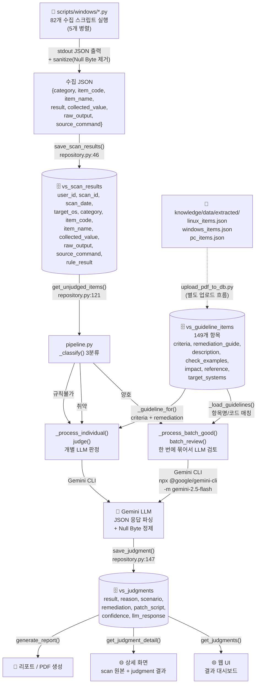
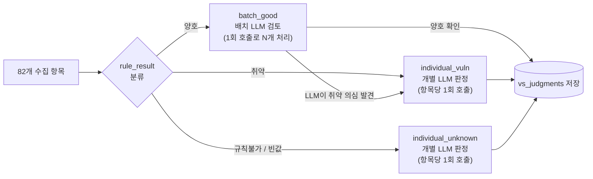

# 📊 데이터 흐름 분석 & 현재 상태 (2026-04-15 기준)

---

## 1. 전체 데이터 흐름



---

## 2. DB 테이블 구조 요약

### vs_scan_results (수집 결과)
| 컬럼 | 타입 | 설명 |
|------|------|------|
| `id` | Integer PK | 자동 증가 |
| `user_id` | VARCHAR(36) | 스캔 실행 사용자 |
| `scan_id` | VARCHAR(64) | 스캔 고유 ID |
| `scan_date` | DateTime | 스캔 일시 |
| `target_os` | VARCHAR(16) | linux / windows |
| `category` | VARCHAR(64) | 계정 관리, 서비스 관리 등 |
| `item_code` | VARCHAR(16) | PC-01, W-01, U-01 등 |
| `item_name` | VARCHAR(128) | 항목명 |
| `collected_value` | Text | 수집된 시스템 정보 |
| `raw_output` | Text | 명령어 실행 원문 |
| `source_command` | Text | 실행된 PowerShell/Bash 명령어 |
| `rule_result` | VARCHAR(16) | 스크립트 1차 판정 (양호/취약/규칙불가) |

### vs_judgments (LLM 판정 결과)
| 컬럼 | 타입 | 설명 |
|------|------|------|
| `judge_id` | Integer PK | 자동 증가 |
| `scan_id` | VARCHAR(64) | 연결된 스캔 ID |
| `user_id` | VARCHAR(36) | 점검 사용자 |
| `item_code` | VARCHAR(16) | 항목 코드 |
| `item_name` | VARCHAR(128) | 항목명 |
| `guideline_ref` | VARCHAR(64) | 가이드라인 참조 |
| `result` | VARCHAR(8) | 최종 판정 (양호/취약) |
| `reason` | Text | LLM 판정 사유 |
| `scenario` | Text | 공격 시나리오 |
| `remediation` | Text | 조치 방법 |
| `patch_script` | Text | 패치 스크립트 |
| `confidence` | Float | 신뢰도 (제거 예정) |
| `llm_response` | Text | LLM 원문 응답 |
| `created_at` | DateTime | 판정 일시 |

### vs_guideline_items (주통기 가이드라인)
| 컬럼 | 타입 | 설명 | LLM 전달 여부 |
|------|------|------|-------------|
| `item_code` | VARCHAR(16) | 항목 코드 | ✅ |
| `item_name` | VARCHAR(256) | 항목명 | ✅ |
| `category` | VARCHAR(64) | 카테고리 | ❌ |
| `target_os` | VARCHAR(16) | 대상 OS | ❌ |
| `importance` | VARCHAR(16) | 중요도 | ❌ |
| `description` | Text | 점검 내용/목적/보안 위협 | ✅ |
| `criteria` | Text | 양호/취약 판단 기준 | ✅ |
| `remediation_guide` | Text | 조치 방법 | ✅ |
| `reference` | Text | 용어 참고 | ✅ |
| `target_systems` | Text | 점검 대상 시스템 | ❌ |
| `impact` | Text | 조치 시 영향 | ✅ |
| `check_examples` | Text | 점검 및 조치 예시 | ✅ |

---

## 3. 스크립트 → DB 필드 매핑

```
스크립트 stdout JSON              →    vs_scan_results 컬럼
───────────────────────────────         ───────────────────
category                          →    category
item_code                         →    item_code
item_name                         →    item_name
collected_value                   →    collected_value
raw_output                        →    raw_output
source_command                    →    source_command
result                            →    rule_result  ⚠️ 이름 변환!
```

---

## 4. LLM 호출 흐름 상세

### 4-1. Gemini CLI 호출 방식
```
npx @google/gemini-cli -m gemini-2.5-flash -p "<시스템 지시문>"
    ↓ stdin으로 프롬프트 전달
    ↓ subprocess.run(input=prompt, ...)
    ↓ stdout으로 JSON 응답 수신
    ↓ _parse_response() / _parse_batch_response()
    ↓ Null Byte 정제 후 DB 저장
```

### 4-2. LLM에 전달되는 정보
```
항목코드: PC-01
항목명: 비밀번호의 주기적 변경

## 주통기 판단 기준
양호 : 최대 암호 사용 기간이 "90일" 이하로 설정된 경우
취약 : 최대 암호 사용 기간이 "제한 없음"이거나 "90일"을 초과하여 설정된 경우

## 주통기 권장 조치
※ 최대 암호 사용 기간 "90일" 설정 ...

## 수집된 시스템 정보
최대 암호 사용 기간 (일): 42 ...

## 관련 주통기 가이드라인
[가이드라인 1] PC-01 비밀번호의 주기적 변경
[점검 내용] 최대 암호 사용 기간이 "90일" 이하 설정 여부 점검 ...
[판단 기준] ...
[조치 방법] ...
[점검 및 조치 예시] ...
[조치 시 영향] ...
```

### 4-3. LLM 응답 JSON 형식
```json
{
  "item_code": "PC-01",
  "result": "양호",
  "reason": "최대 암호 사용 기간이 42일로 90일 이하 기준을 충족함",
  "scenario": "",
  "remediation": "",
  "patch_script": "",
  "confidence": 1.0
}
```

---

## 5. 파이프라인 3단계 분류 흐름



---

## 6. 현재 상태 ✅ / ❌ 체크리스트

| 구간 | 상태 | 비고 |
|------|------|------|
| 스크립트 stdout → scan JSON | ✅ 정상 | 82개 Windows 스크립트 |
| Null Byte 정제 (sanitize) | ✅ 적용됨 | scan.py, manual_test.py, llm_judge.py |
| scan JSON → vs_scan_results DB 저장 | ✅ 정상 | result → rule_result 매핑 |
| DB → get_unjudged_items() → pipeline | ✅ 정상 | rule_result → result rename |
| _classify() 3분류 | ✅ 정상 | 양호/취약/규칙불가 |
| 가이드라인 로드 (vs_guideline_items) | ✅ 정상 | 149개 항목, 전체 필드 전달 |
| _build_guideline_list() content 채우기 | ✅ 정상 | description/criteria/remediation 등 포함 |
| LLM 판정 후 vs_judgments 저장 | ✅ 정상 | llm_response 원문 포함 |
| 5개 병렬 수집 | ✅ 적용됨 | asyncio.Semaphore(5) |
| 서버 Hot-Reload 비활성화 | ✅ 적용됨 | reload=False |
| 포트 | ✅ 8081 | 좀비 프로세스 회피 |
| 웹 UI 신뢰도 표시 | ❌ 아직 존재 | 제거 필요 |
| 리포트/PDF 생성 | ❌ 미구현 | TODO |
| 패치 스크립트 실행 (UAC) | ❌ 미구현 | TODO |
| scan_id 고유값 체계 | ❌ 매번 랜덤 | PC 고유값 기반으로 변경 필요 |

---

## 7. 🔜 앞으로 할 일 (TODO)

### TODO 1. 웹 페이지에서 신뢰도(Confidence) 제거
- **현재:** 웹 UI 상세 화면에 `신뢰도: XX%` 표시
- **변경:** 보안 진단 특성상 1개라도 취약이면 즉시 '취약'이므로 확률적 수치는 의미 없음
- **대상 파일:** 웹 템플릿(detail.html 등), `get_judgments()` 반환값

### TODO 2. 리포트 생성 및 PDF 생성
- **현재:** `vs_reports` 테이블과 `save_report()` 함수는 존재하나 실제 생성 로직 미구현
- **구현 내용:** 스캔 결과 + LLM 판정 결과를 종합하여 PDF 리포트 자동 생성
- **대상 파일:** `report/` 디렉토리, 새 PDF 생성 모듈

### TODO 3. 패치 스크립트 실행 (UAC 관리자 권한)
- **현재:** LLM이 `patch_script` 필드에 PowerShell 조치 스크립트를 생성해줌
- **구현 내용:** 웹 UI에서 "패치 적용" 버튼 → UAC 권한 상승 → 패치 스크립트 실행
- **주의:** Windows 환경에서 관리자 권한 요청(UAC 팝업) 필요

### TODO 4. 패치 실패 시 Gemini CLI로 스크립트 재작성
- **현재:** 패치 스크립트 실행 실패 시 재시도 로직 없음
- **구현 내용:** 실패 시 Gemini CLI를 호출하여 스크립트를 재작성
- **LLM에 전달할 입력:**
  - 현재 패치 스크립트 원본
  - 오류 결과 (stderr / exit code)
  - vs_guideline_items의 조치 사항 (`remediation_guide`)
  - vs_guideline_items의 조치 예시 (`check_examples`)
  - 기타 DB 관련 정보

### TODO 5. scan_id 고유값 체계 개편
- **현재 문제:** 같은 PC에서 같은 사용자가 반복 스캔해도 `scan_id`가 매번 UUID로 달라짐
- **원래 의도:** 사용자/컴퓨터별로 고유하게 식별하여 이전 결과와 비교 가능하게 하려 했음
- **개선 방향:**
  - **Windows:** 머신 고유값(예: `wmic csproduct get UUID`, 또는 MAC 주소 + 호스트명 조합)
  - **Linux:** `/etc/machine-id`, MAC 주소, 또는 호스트 fingerprint 등 (컴퓨터가 달라졌을 때 구분 가능한 값 선정 필요)
  - scan_id = `{machine_id}-{user_id}-{target_os}` 형태로 구조화하여 동일 PC 재스캔 시 덮어쓰기 또는 이력 관리 가능

### TODO 6. 웹 대시보드 진행률(%) 기준 변경
- **현재 문제:** 진행률 %가 스크립트 수집 완료 기준으로 움직이고, LLM 판정 중에는 진행이 안 보임
- **개선:** 스크립트 수집 후 LLM 판정 완료까지 포함한 전체 진행률로 변경
- **세부:**
  - 수집 단계: 0% ~ 30% (82개 스크립트 수집)
  - LLM 판정 단계: 30% ~ 100% (82개 항목 판정)
  - 프론트엔드에서는 LLM 판정 polling으로 %를 업데이트

### TODO 7. 웹 대시보드에서 "판정" 버튼/업로드 부분 삭제
- **현재:** 대시보드에 별도의 "판정 실행" 또는 업로드 관련 UI가 존재
- **변경:** 스캔 시작 → 수집 → LLM 판정까지 자동으로 한 번에 끝나므로, 별도 판정 트리거 UI 불필요

### TODO 8. Gemini CLI 터미널 로그 간소화
- **현재 로그 형태:**
  ```
  engine.llm_judge: Gemini CLI start [6883e854] context=judge:PC-08
  cmd=npx @google/gemini-cli -m gemini-2.5-flash -p "stdin의 지시를 그대로
  수행하고 최종 답변만 출력하세요. 인사말, 자기소개, 추가 질문, 설명을 쓰지
  말고 stdin에 JSON 형식이 지정되어 있으면 반드시 그 형식만 출력하세요."
  prompt_len=1984 cwd=C:\Users\Public\...
  ```
- **문제:** cmd 전문과 -p 인자 내용이 매번 반복되어 터미널이 지저분함
- **개선:** `[LLM] PC-08 판정 시작 (1984자)` 수준으로 간결하게 변경
